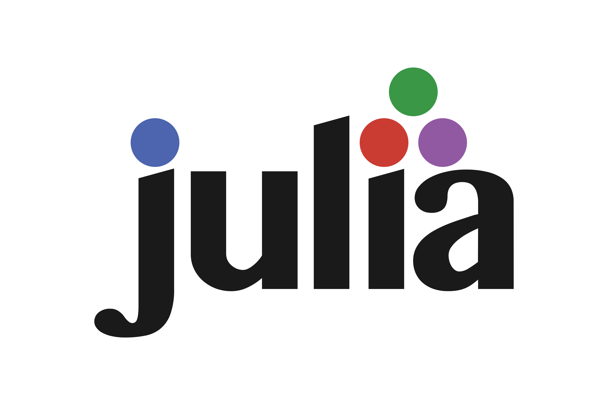

# NeuroJulia

<a name="logo"/>

</img>
</a>

## ML Framework in Julia

(In progress)

Julia is a high-level, high-performance dynamic language for technical
computing. This repository hosts the source code for NeuroJulia - an attempt 
to design a framework for deep learning in Julia.

### Notes

We'd love feedback :) 
The repository will be open to community contributions soon.
